## if문
>if (조건식) { 
>   // 조건이 참일 때 실행되는 코드 
}
- 조건식은 boolean 타입이어야 하며, true 또는 false를 반환합니다.
- 중괄호 {} 안의 코드는 조건식이 true일 때만 실행됩니다.

## if문의 예시
>int age = 18; 
if (age >= 18)  { 
System.out.println("성인입니다."); 
}

출력값
>성인입니다.
-----------
## if-else 문
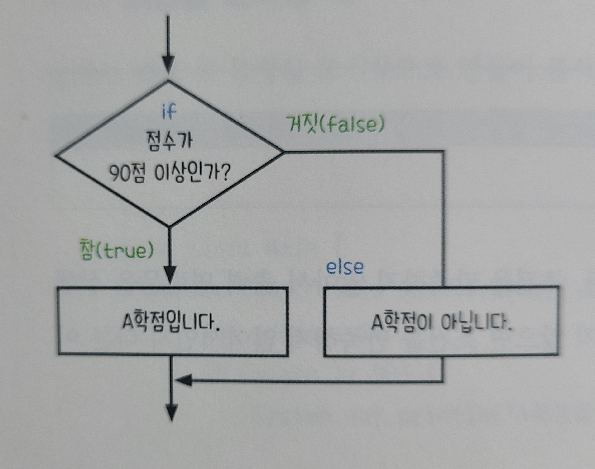
>if (조건식)  { 
// 조건이 참일 때 
} else { 
// 조건이 거짓일 때 
}

## if-else 문의 예시
>int score = 95; 
if (score >= 90)  { 
System.out.println("A학점 입니다."); 
} else { 
System.out.println("A학점이 아닙니다."); 
}

## if - else if - else 문
#### 여러 조건을 순차적으로 검사할 때 사용합니다.
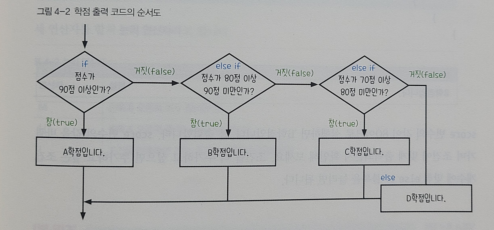
>if (조건1)  { 
// 조건1이 참일 때 
} else if (조건2) { 
// 조건2가 참일 때 
} else { 
// 모든 조건이 거짓일 때 
}

## if-else if- else문의 예시
> int score = 85; 
if (score >= 90)  { 
System.out.println("A학점"); 
} else if (score >= 80) { 
System.out.println("B학점"); 
} else if (score >= 70) { 
System.out.println("C학점"); 
} else { 
System.out.println("F학점"); 
}
---
## 논리 연산자
- 논리 연산자(logical operators)는 불리언(boolean) 값을 다루는 연산자로, 조건문에서 주로 사용됩니다. 각각의 논리 연산자는 참(true) 또는 거짓(false)을 판단하고 조합하는 데 사용됩니다. 자바의 주요 논리 연산자는 다음과 같습니다:
1. && (논리 AND) 
   두 조건이 모두 true일 때만 true를 반환합니다. 
하나라도 false면 결과는 false입니다. 
> boolean result = (5 > 3) && (10 > 7);  // true && true → true

2. || (논리 OR) 
   두 조건 중 하나라도 true면 true를 반환합니다. 
둘 다 false여야만 결과가 false입니다. 
> boolean result = (5 < 3) || (10 > 7);  // false || true → true

3. ! (논리 NOT) 
   조건의 참/거짓을 반대로 바꿉니다. 
true → false, false → true 
> boolean result = !(5 > 3);  // !(true) → false
---
## 중첩 if문 (nested if)
#### if문 안에 또 다른 if문을 넣을 수 있습니다
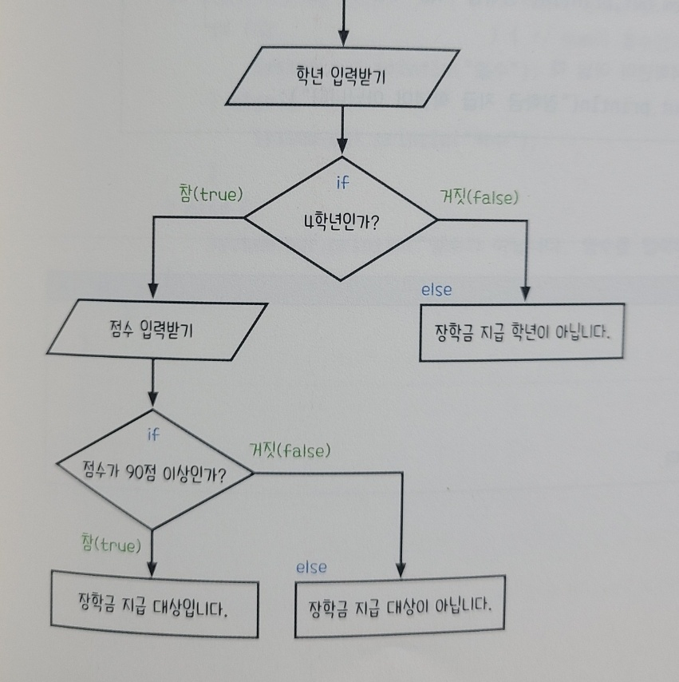
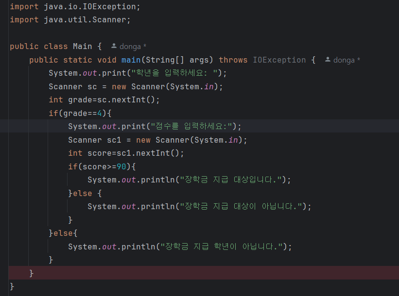
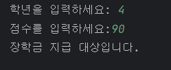
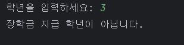
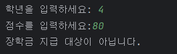
--- 
## switch 문
- switch 괄호 안의 값(변수) 을 case 들과 순차적으로 비교함. 
- 일치하는 case를 만나면, 해당 블록 실행 후 break로 빠져나감. 
- break가 없으면 아래 case 들도 계속 실행됨. 
- default는 모든 case에 해당하지 않을 경우 실행 (선택사항). 
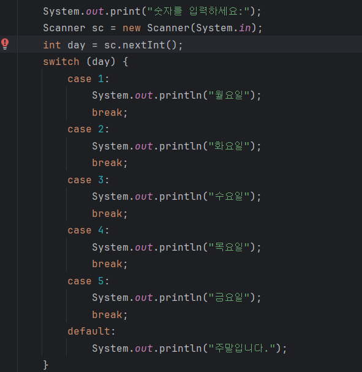
---
## 삼항연산자
#### 조건문을 간단히 표현할 수 있는 연산자로 if-else를 한 줄로 축약하고 싶을 때 매우 유용
> 변수 = (조건식) ? 참일 때 값 : 거짓일 때 값;
- (조건식) → boolean 값을 반환해야 된다.
- 조건식이 **true**면 ? 다음 값이 선택되고
- 조건식이 **false**면 : 다음 값이 선택된다.
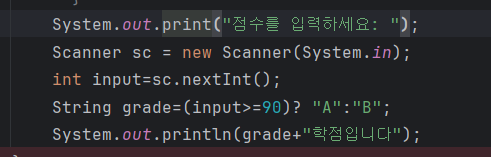
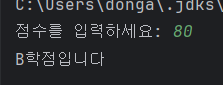
- 
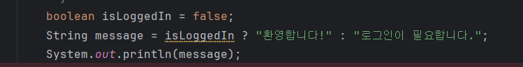
---
## self-check
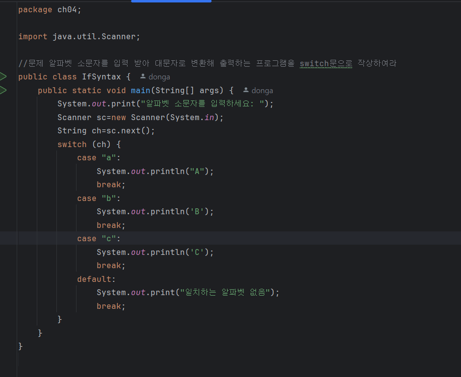